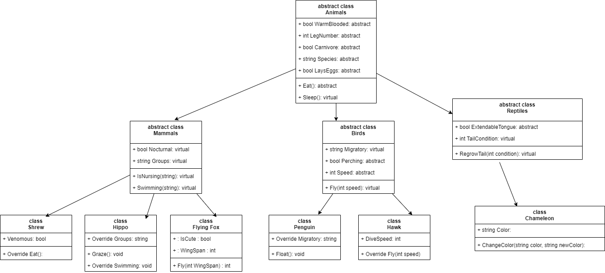
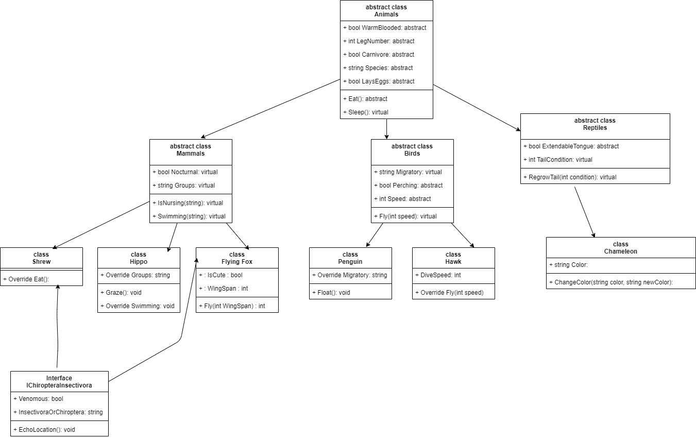

# LET'S MAKE A ZOO
> Exploring the principles behind OOP in C#

## Table of Contents
* [General Info](#general-information)
* [Technologies Used](#technologies-used)
* [Features](#features)
* [Images](#screenshots)
* [Setup](#setup)
* [Usage](#usage)
* [Project Status](#project-status)
* [Room for Improvement](#room-for-improvement)
* [Acknowledgements](#acknowledgements)
* [Contact](#contact)
<!-- * [License](#license) -->

## General Information

* This is a project done for Code Fellows 401.ASP.Net course in advanced software development. It was designed as an educational tool to teach and experiment with the principles of Object Oriented Programming in C#. To do this we created an imaginary zoo and filled with with several animals. In our problem domain we mapped out the general flow of inheritence before getting started.

* On day two we went back and refactored all code to include interfaces as well as inheritence.

## Technologies Used

* This program was written entirely in C# 9.0 and .Net 5 on Visual Studio 2019.

## Features

* Can create instances of species objects, which all inherit props and methods from at least three levels up from the parent class Animal. Class can also be assigned interfaces.

## Images : UML

## Setup

In order to use this project you will need to clone it from the Github Repo. At this point in time the program does not have a working executable file. It is meant to be used purely to play with class creation, inheritence, instancing, and interfaces.

## Usage

To use it simply clone the repo and edit the code inside of Visual Studio 2019.

## Project Status

Project is: Complete

## Room for Improvement

To do:
[x] Refactor to include interfaces.

## Acknowledgements

The problem domain was created with the help of [Steven Boston](https://github.com/Steven-Boston)

## Contact
Created by [Joshua Haddock](https://www.linkedin.com/in/joshuahaddock/) - feel free to contact me!

Created using an MIT license.
